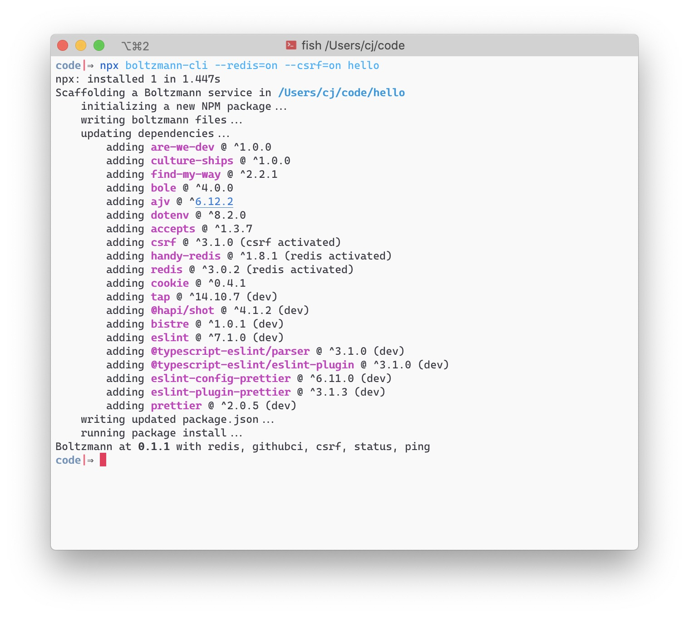

# boltzmann


Boltzmann is a JavaScript framework for writing web servers. It is implemented in a single file that lives alongside your code. Boltzmann is focused on delivering a great developer experience and makes its tradeoffs with that goal in mind.

Our design goals:

- Make all return values from route handlers and middlewares be valid responses, mapping to http semantics.
- Prefer zero-cost abstractions: pay for what you use and nothing more, including in installation and startup time.
- Use global types, no special response types.
- Only modify objects we provide; do not rely on modifications to node's request & response objects.
- Provide pluggable behavior for body-parsing and middleware, with good defaults.
- Use only minimal, well-vetted dependencies.
- Bake in observability (optionally), via [Honeycomb](https://honeycomb.io) tracing.
- Rely on a little bit of documented convention to avoid configuration.
- Making throwing Boltzmann away if you need to move on _possible_.

Boltzmann provides Typescript definitions for its exports, for your development convenience, but it does not require you to opt-in to Typescript or do any transpilation. We'd like you to be able to run Boltzmann apps under deno or in a web worker some day, so we make API choices that move us toward that goal.

## Getting started

For full Boltzmann docs, visit [the documentation site](https://www.boltzmann.dev/en/docs/v0.1.2/).

If you prefer to look at working example code, we've provided examples in the [`./examples`](https://github.com/entropic-dev/boltzmann/tree/latest/examples) directory of this repo.

To get started with Boltzmann, run the `boltzmann` command-line tool. You can get it from [the releases page][https://github.com/entropic-dev/boltzmann/releases] or run it via `npx boltzmann-cli`. The tool is responsible for initializing a new Boltzmann project as well as keeping it up to date. You enable or disable specific Boltzmann features using the tool.

For example, to scaffold with the defaults:

```shell
projects|⇒ npx boltzmann-cli ./hello
```



A complete Boltzmann hello world is provided for you.

```shell
hello|⇒ ls
boltzmann.js*  handlers.js  middleware.js  node_modules/  package-lock.json  package.json
```

Take a look at `handlers.js`:

```js
import { Context } from './boltzmann.js' // optionally pull in typescript definition

greeting.route = 'GET /hello/:name'
export async function greeting(/** @type {Context} */ context) {
    return `hello ${context.params.name}`
}

module.exports = {
  greeting
}
```

To respond from a Boltzmann handler, you return a value. To return an error, you throw. Boltzmann will map values and exceptions to http semantics.

To run: `./boltzmann.js`. And to view the response: `curl http://localhost:5000/hello/world`

## Team

Who's the "we" in this document? [@ceejbot](https://github.com/ceejbot) and [@chrisdickinson](https://github.com/chrisdickinson).

## LICENCE

Apache-2.0.
